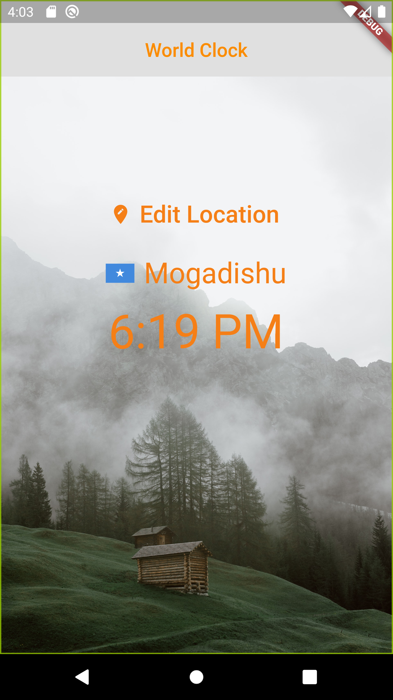
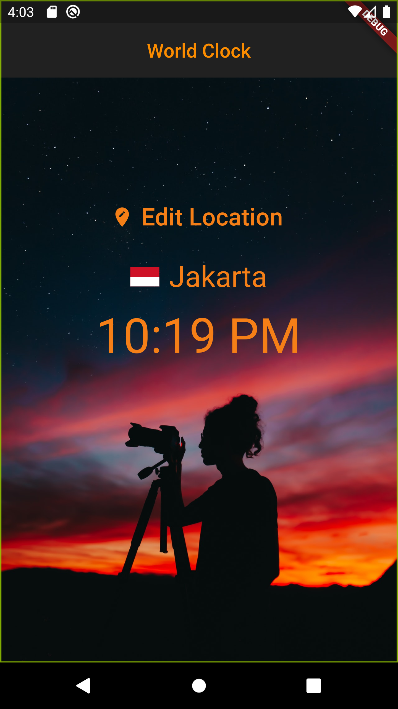
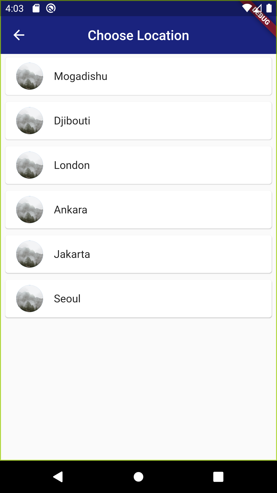

== Simple Clock App

Check this app if you want to know the time of a specific city in the world

== Getting Started

- Install Android Studio or any other IDE
- Install Dart and Flutter
- Clone this repo
- Start development

== Screenshots

